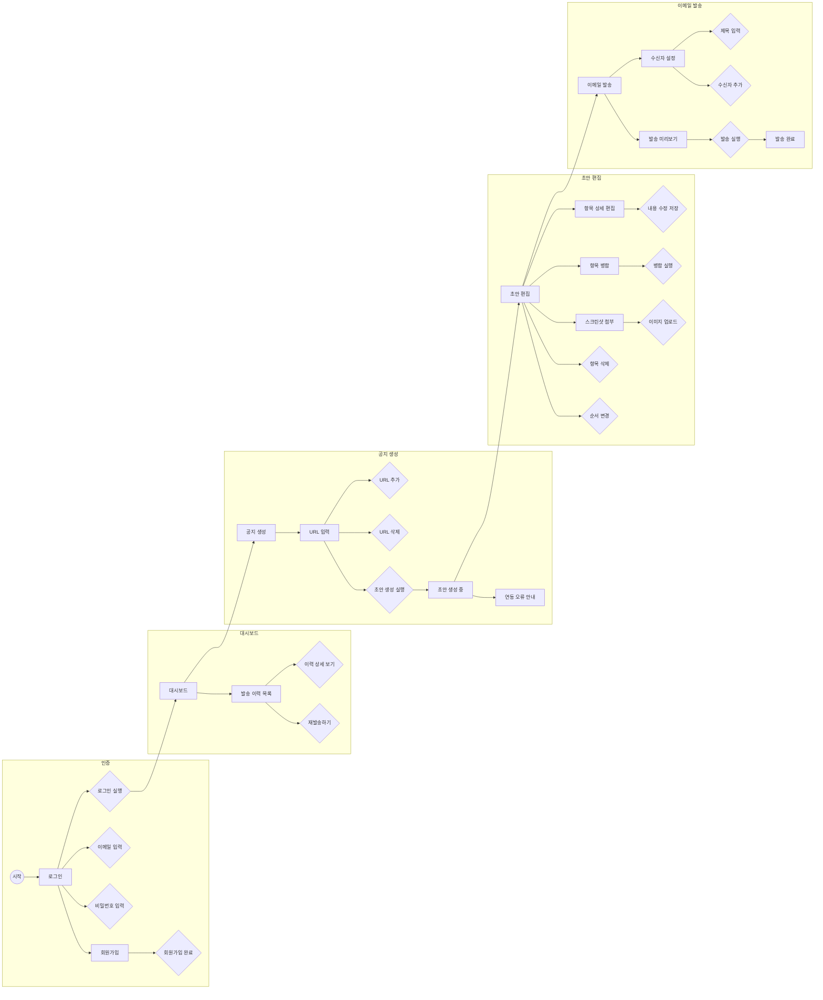

```mermaid
flowchart LR

  subgraph s1 ["인증"]
    n1(("시작"))
    n2["로그인"]
    n3["회원가입"]
    n4{"이메일 입력"}
    n5{"비밀번호 입력"}
    n6{"로그인 실행"}
    n7{"회원가입 완료"}
  end

  subgraph s2 ["대시보드"]
    n8["대시보드"]
    n9["발송 이력 목록"]
    n10{"이력 상세 보기"}
    n11{"재발송하기"}
  end

  subgraph s3 ["공지 생성"]
    n12["공지 생성"]
    n13["URL 입력"]
    n14["초안 생성 중"]
    n15["연동 오류 안내"]
    n16{"URL 추가"}
    n17{"URL 삭제"}
    n18{"초안 생성 실행"}
  end

  subgraph s4 ["초안 편집"]
    n19["초안 편집"]
    n20["항목 상세 편집"]
    n21["항목 병합"]
    n22["스크린샷 첨부"]
    n23{"항목 삭제"}
    n24{"순서 변경"}
    n26{"내용 수정 저장"}
    n27{"병합 실행"}
    n28{"이미지 업로드"}
  end

  subgraph s5 ["이메일 발송"]
    n29["이메일 발송"]
    n30["수신자 설정"]
    n31["발송 미리보기"]
    n32["발송 완료"]
    n33{"제목 입력"}
    n34{"수신자 추가"}
    n35{"발송 실행"}
  end

  n1 --> n2
  n2 --> n3
  n2 --> n4
  n2 --> n5
  n2 --> n6
  n3 --> n7
  n6 --> n8
  n8 --> n9
  n8 --> n12
  n9 --> n10
  n9 --> n11
  n12 --> n13
  n13 --> n16
  n13 --> n17
  n13 --> n18
  n18 --> n14
  n14 --> n19
  n14 --> n15
  n19 --> n20
  n19 --> n21
  n19 --> n22
  n19 --> n23
  n19 --> n24
  n20 --> n26
  n21 --> n27
  n22 --> n28
  n19 --> n29
  n29 --> n30
  n29 --> n31
  n30 --> n33
  n30 --> n34
  n31 --> n35
  n35 --> n32
```
