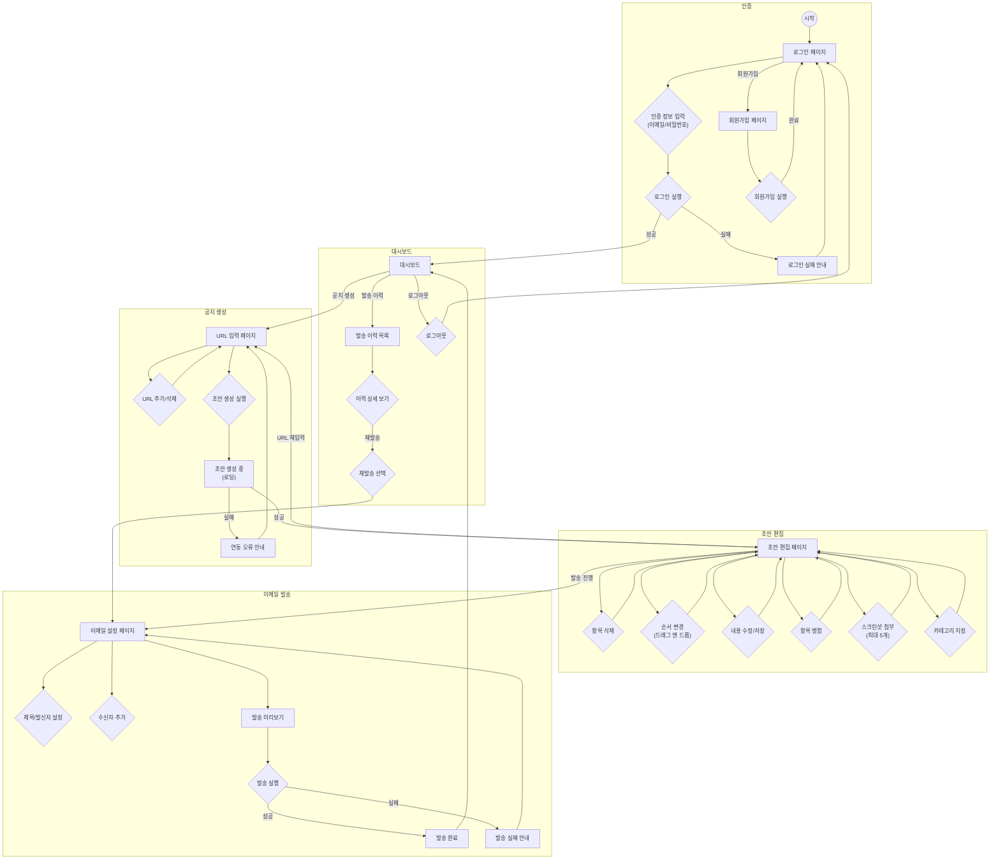

```mermaid
flowchart TD

  subgraph s1 ["인증"]
    n1(("시작"))
    n2["로그인 페이지"]
    n3["회원가입 페이지"]
    n4{"인증 정보 입력\n(이메일/비밀번호)"}
    n5{"로그인 실행"}
    n6["로그인 실패 안내"]
    n7{"회원가입 실행"}
  end

  subgraph s2 ["대시보드"]
    n8["대시보드"]
    n9["발송 이력 목록"]
    n10{"이력 상세 보기"}
    n11{"재발송 선택"}
    n12{"로그아웃"}
  end

  subgraph s3 ["공지 생성"]
    n13["URL 입력 페이지"]
    n14{"URL 추가/삭제"}
    n15{"초안 생성 실행"}
    n16["초안 생성 중\n(로딩)"]
    n17["연동 오류 안내"]
  end

  subgraph s4 ["초안 편집"]
    n18["초안 편집 페이지"]
    n19{"항목 삭제"}
    n20{"순서 변경\n(드래그 앤 드롭)"}
    n21{"내용 수정/저장"}
    n22{"항목 병합"}
    n23{"스크린샷 첨부\n(최대 5개)"}
    n24{"카테고리 지정"}
  end

  subgraph s5 ["이메일 발송"]
    n25["이메일 설정 페이지"]
    n26{"제목/발신자 설정"}
    n27{"수신자 추가"}
    n28["발송 미리보기"]
    n29{"발송 실행"}
    n30["발송 완료"]
    n31["발송 실패 안내"]
  end

  %% 인증 플로우
  n1 --> n2
  n2 -->|회원가입| n3
  n3 --> n7
  n7 -->|완료| n2
  n2 --> n4
  n4 --> n5
  n5 -->|성공| n8
  n5 -->|실패| n6
  n6 --> n2

  %% 대시보드 플로우
  n8 -->|공지 생성| n13
  n8 -->|발송 이력| n9
  n8 -->|로그아웃| n12
  n12 --> n2
  n9 --> n10
  n10 -->|재발송| n11
  n11 --> n25

  %% 공지 생성 플로우
  n13 --> n14
  n14 --> n13
  n13 --> n15
  n15 --> n16
  n16 -->|성공| n18
  n16 -->|실패| n17
  n17 --> n13

  %% 초안 편집 플로우
  n18 --> n19
  n18 --> n20
  n18 --> n21
  n18 --> n22
  n18 --> n23
  n18 --> n24
  n19 --> n18
  n20 --> n18
  n21 --> n18
  n22 --> n18
  n23 --> n18
  n24 --> n18
  n18 -->|발송 진행| n25
  n18 -->|URL 재입력| n13

  %% 이메일 발송 플로우
  n25 --> n26
  n25 --> n27
  n25 --> n28
  n28 --> n29
  n29 -->|성공| n30
  n29 -->|실패| n31
  n31 --> n25
  n30 --> n8
```
